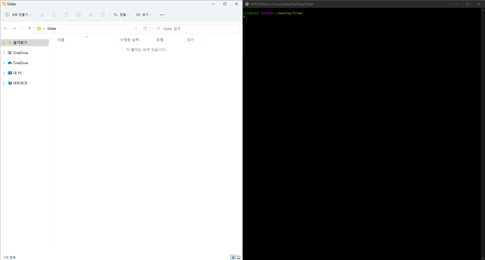

# [Git 특강 첫째날]


## 1. Git을 이용한 버전관리

- 백업/복구/협업을 위해 버전관리 필요 -> Git을 이용 (분산버전관리 가능!)


## 2. CLI와 GUI

- CLI(Command Line Interface) : 터미널을 통해 사용자와 컴퓨터가 상호 작용하는 방식 (그림 오른쪽)

- GUI(Graphic User Interface) : 그래픽을 통해 사용자와 컴퓨터가 상호 작용하는 방식 (그림 왼쪽)

  - GUI는 CLI에 비해 컴퓨터의 성능을 더 많이 소모하고, CLI가 더 많은 세부적인 기능을 사용할 수 있으므로 CLI에 익숙해지는 것이 좋음.

    




- 경로
  - 루트 디렉토리: `/`, 최상위 폴더, 윈도우에서 C드라이브
  - 홈 디렉토리 :`~`,  현재 로그인 된 사용자의 홈 폴더이며, Windows의 경우 `C:/사용자(Users)/현재 사용자 계정`

- 절대경로 & 상대경로

  - 절대경로
    - 루트 디렉토리부터 목적 지점까지 거치는 모든 경로를 전부 작성
  
  - 상대경로
    - 현재 작업하고 있는 디렉토리를 기준으로 상대적 위치 작성
    - 현재 작업하고 있는 디렉토리가 `C:/Users` 라고 한다면 윈도우 바탕 화면으로의 상대 경로는 `현재사용자계정/Desktop` 이 된다.
    - 간결해서 좋지만, 현재 작업하고 있는 디렉토리가 변경 되면 상대 경로도 변경됩니다.
    - `./` : 현재 작업하고 있는 폴더
    - `../` : 현재 작업하고 있는 폴더의 부모(상위) 폴더
  
- 터미널 명령어

  - touch : 새 파일 생성

  ``` touch text.txt``` 

  

  - mkdir :  새폴더를 생성

   ```mkdir folder
    mkdir forder
    mkdir 'happy hacking'   << 뛰어쓰기는 ''로 표현 가능
   ```

  - ls : 현재 작업 중인 디렉토리의 폴더/파일 목록을 보여줌
    - list segments
    - `-a` : all 옵션. 숨김 파일까지 모두 보여준다.
    - `-l` : long 옵션. 용량, 수정 날짜 등 파일 정보를 자세히 보여준다.
  - mv : 폴더/파일을 다른 폴더로 이동하거나 이름을 변경함
    - move
    - 단, 다른 폴더로 이동할 때는 작성한 폴더가 반드시 있어야 한다. 없으면 이름이 변경된다.
  - cd : 현재 작업중인 디렉토리를 변경함

    - `cd ~` 를 입력하면 홈 디렉토리로 이동 (단순히 `cd` 라고만 입력해도 동일합니다.)
    - `cd ..` 를 입력하면 부모 디렉토리로 이동  (위로 가기)
    - `cd -` 를 입력하면 바로 전 디렉토리로 이동 (뒤로 가기)
  - rm : 폴더/파일 지우는 명령어
  - 명령어들

   ```bash
     # 폴더 생성
     mkdir CLI
     mkdir 'multi campus'
    
     # 목록 조회
     ls
     ls -a
     ls -l
     ls -a -l
    
     # 위치 변경
     cd CLI
     cd ..
     cd ~
    
     # 파일 생성
     touch a.txt
     touch a.txt b.txt c.txt
    
     # 파일, 폴더 제거
     rm a.txt
     rm -r new
   ```


## 3. Markdown

- 제목표기

  - \# 제목1, ## 제목2, ### 제목3, ### 제목4  <-  `#`개수가 늘어날때마다 폰트 크기 작아짐

  - # 제목1  

  - ## 제목2

  - ### 제목3

  - #### 제목4

    

-  목록(List)

  - 순서가 없는 목록은 `- * + `를 사용
  - 순서가 있는 목록은 `1, 2, 3, `과 같은 숫자 사용
  - `tab키`를 이용해서 들여쓰기 & 하위목록 가능


- 강조 (글자 스타일링)

  - 기울임(이탤릭체): `*글자*` , `_글자_` => *글자*

  - 굵게(볼드체): `**글자**`,` __글자__ ` => **글자**

  - 취소선 : `~~글자~~` => ~~글자~~

- 코드(Code)
  - 인라인코드(= 한줄)  : 백틱키(1번 왼쪽키)로 감싸준다.   `print("Hello World!") `
  - 블록코드(= 여러줄)   : 백틱키 3번 입력

```python
for i in ange(10):
    print(i)

```

- 수평선
  - `-,*,_` 3번 연속작성

***


- 표(table)

  - 테이블(표)를 생성합니다.

  - `파이프( | )`와 `하이픈( - )`을 이용해서 행과 열을 구분합니다.

  - 테이블 양쪽 끝의 `파이프( | )`는 생략 가능합니다.

  - 헤더 셀을 구분할 때는 `3개 이상의 하이픈( - )`이 필요합니다.

  - Typora에서는 `ctrl + T` 를 통해서 쉽게 표 생성이 가능합니다.

  - 행을 늘릴 때는 `ctrl + enter` 를 누릅니다.

```
```| 동물   | 종류   | 다리 개수 |
   | ------ | ------ | --------|
   | 사자   | 포유류 | 4개       |
   | 닭     | 조류   | 2개       |
   | 도마뱀 | 파충류 | 4개       |
```


| 동물   | 다리개수 | 종     |
| ------ | -------- | ------ |
| 사자   | 4개      | 포유류 |
| 원숭이 | 2개      | 포유류 |
| 앵무새 | 2개      | 조류   |


- 화면전환
  - `ctrl + / `입력하면  html화면으로 전환된다.


